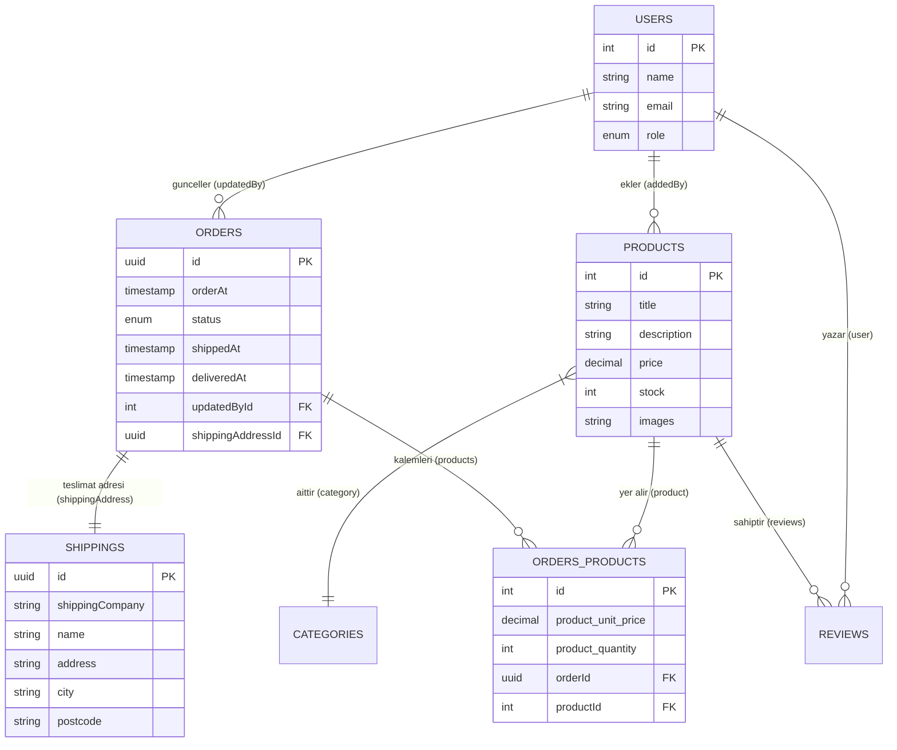

# 📦 Sipariş & Ürün İlişkileri Mimarisi (Entity Architecture)

Bu doküman, `orders` ve `products` modülleri arasındaki veritabanı ilişkilerini (`TypeORM` ve `PostgreSQL`), veritabanı tablolarını ve gerçek hayat örneklerini detaylıca açıklar.

---

## 📐 Veritabanı İlişki Şeması (Mermaid Diagram)



---

## 🗂️ Tablolar ve İlişki Açıklamaları

### 1. `orders` ── (1 to 1) ── `shippings`
- **İlişki Türü:** Bire Bir (`@OneToOne`)
- **Açıklama:** Her **Siparişin** sadece 1 tane kargo teslimat adresi olur. Her **Kargo Adresi** de sadece 1 siparişe aittir.
- **Foreign Key:** `orders` tablosundaki `shippingAddressId` sütunu.
- **Cascade:** `cascade: true` sayesinde sipariş kaydedilirken kargo adresi de otomatik kaydolur.

---

### 2. `orders` ── (1 to N) ── `orders_products` ── (N to 1) ── `products`
- **İlişki Türü:** Çoktan Çoka İlişki (Ara Tablo / Junction Table ile `Many-to-Many`)
- **Neden Ara Tablo Kullanıyoruz?**
  1. Bir siparişte birden fazla ürün olabilir (Örn: 2 iPhone, 1 AirPods).
  2. Bir ürün zamanla binlerce farklı siparişte yer alabilir.
  3. **Satın Alınan Adet (`product_quantity`)** ve **Sipariş Anındaki Fiyat (`product_unit_price`)** bilgisi doğrudan `products` veya `orders` tablosunda saklanamaz. Çünkü ürünün fiyatı yarın değişebilir ama siparişteki eski fiyat sabit kalmalıdır.

---

### 3. `users` ── (1 to N) ── `orders`
- **İlişki Türü:** Birden Çoka (`@ManyToOne` / `@OneToMany`)
- **Açıklama:** Siparişin durumunu (Processing -> Shipped -> Delivered) güncelleyen yetkili kullanıcı (`updatedBy`). Bir yetkili (Admin) zamanla binlerce siparişi güncelleyebilir.

---

## 💡 Gerçek Hayat Örneği (Postman / JSON Payload)

Bir sipariş oluşturulduğunda veritabanında saklanan yapı:

```json
{
  "id": "a8c9e01f-54b2-4d9e-b98a-123456789abc",
  "status": "processing",
  "orderAt": "2026-10-09T20:00:00.000Z",
  "shippingAddress": {
    "id": "e7b1a2c3-9876-4532-a1b2-987654321xyz",
    "shippingCompany": "Yurtiçi Kargo",
    "name": "Elgün Ezmemmedov",
    "address": "Atatürk Cad. No:12",
    "city": "İstanbul",
    "postcode": "34000",
    "country": "Türkiye"
  },
  "products": [
    {
      "id": 101,
      "product_unit_price": 50000.00,
      "product_quantity": 2,
      "product": {
        "id": 1,
        "title": "iPhone 15 Pro"
      }
    },
    {
      "id": 102,
      "product_unit_price": 7000.00,
      "product_quantity": 1,
      "product": {
        "id": 2,
        "title": "AirPods Pro"
      }
    }
  ]
}
```
